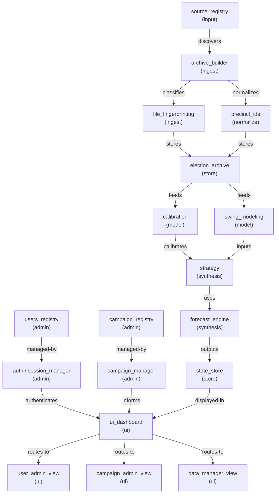

# System Dependency Graph
**Run ID:** 20260313__platform_audit

## Node Registry
| ID | Type | Layer |
|----|------|-------|
| `source_registry` | config | input |
| `archive_builder` | engine | ingest |
| `file_fingerprinting` | engine | ingest |
| `precinct_ids` | engine | normalize |
| `election_archive` | data | store |
| `calibration` | engine | model |
| `swing_modeling` | engine | model |
| `strategy` | engine | synthesis |
| `forecast_engine` | engine | synthesis |
| `campaign_manager` | engine | admin |
| `auth / session_manager` | engine | admin |
| `users_registry` | config | admin |
| `campaign_registry` | config | admin |
| `ui_dashboard` | ui | ui |
| `user_admin_view` | ui | ui |
| `campaign_admin_view` | ui | ui |
| `data_manager_view` | ui | ui |
| `state_store` | data | store |

## Dependencies
| From | Relationship | To |
|------|--------------|----|
| `source_registry` | discovers | `archive_builder` |
| `archive_builder` | classifies | `file_fingerprinting` |
| `archive_builder` | normalizes | `precinct_ids` |
| `file_fingerprinting` | stores | `election_archive` |
| `precinct_ids` | stores | `election_archive` |
| `election_archive` | feeds | `calibration` |
| `election_archive` | feeds | `swing_modeling` |
| `calibration` | calibrates | `strategy` |
| `swing_modeling` | inputs | `strategy` |
| `strategy` | uses | `forecast_engine` |
| `forecast_engine` | outputs | `state_store` |
| `campaign_registry` | managed-by | `campaign_manager` |
| `users_registry` | managed-by | `auth / session_manager` |
| `auth / session_manager` | authenticates | `ui_dashboard` |
| `campaign_manager` | informs | `ui_dashboard` |
| `state_store` | displayed-in | `ui_dashboard` |
| `ui_dashboard` | routes-to | `user_admin_view` |
| `ui_dashboard` | routes-to | `campaign_admin_view` |
| `ui_dashboard` | routes-to | `data_manager_view` |
